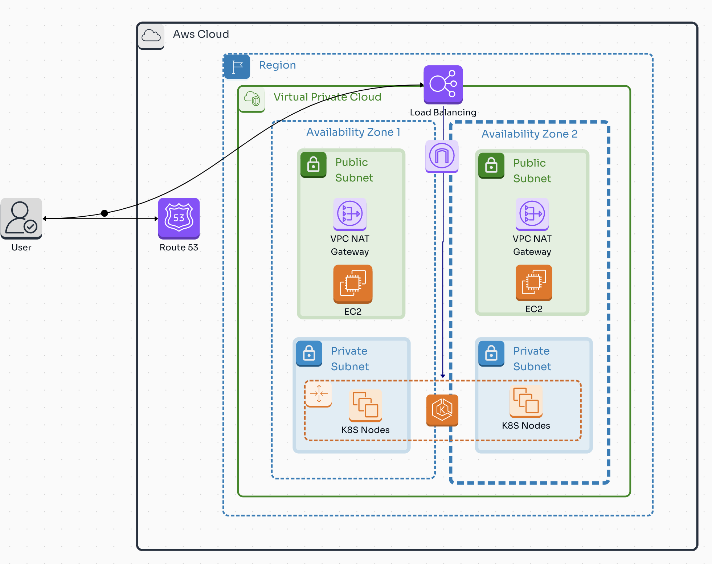
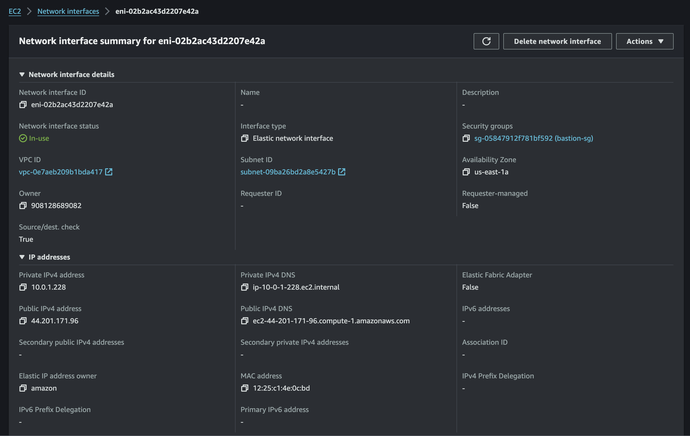

## Meru Infrastructure 🚀

Evaluate skills in systems administration, automation, and infrastructure management using core DevOps
infrastructure using core DevOps technologies such as AWS, Docker, Kubernetes, Linux,
Networking and Terraform.



### Prerequisites

- AWS Account ans AWS CLI
- Terraform
- Docker
- Kubernetes

### Installation

1. Clone the repository
   ```sh
   git clone https://github.com/alejandro945/meru-infrastructure.git
    ```
2. Change directory
   ```sh
   cd meru-infrastructure
    ```
3. Create a user for Terraform in AWS and attach admin policies (training purposes only)
    ```sh
    aws iam create-user --user-name cli_terraform
    aws iam attach-user-policy --policy-arn arn:aws:iam::aws:policy/AdministratorAccess --user-name cli_terraform
    aws iam create-access-key --user-name cli_terraform
    ```
    
4. Run the following commands to create the infrastructure
    ```sh
    aws configure
    cd iac
    terraform init
    terraform apply -auto-approve
     ```
    
5. To deploy the application in eks cluster
    ```sh
    aws eks --region us-east-1 update-kubeconfig --name meru-cluster
    # Ensure your user is attach in the access entries of the cluster with admin cluster policy
    kubectl get nodes -- Test the connection
    cd orchestation
    kubectl create namespace meru && helm upgrade --install meru-app ./compute -n meru && kubectl apply -f nginx.yaml -n meru
     ```
    
6. To access the application
    ```sh
    kubectl get svc -n meru
    # Copy the external ip and paste in the browser
    ```
    
7. To destroy the infrastructure
    ```sh
    terraform destroy -auto-approve
    ```

### Tasks

1. Infrastructure Approvisioning using Terraform in AWS ✅

- Using Terraform, create an environment on AWS that includes:
    - An EC2 instance running Linux ubuntu. ✅
    
    - A Security Group that allows SSH (port 22) and HTTP (port 80) access. ✅
    
    - A public IP address assigned to the EC2 instance. ✅
    

- Make sure that the Terraform configuration file is modular and can be reused to deploy multiple instances.
to deploy multiple instances. ✅

2.  Containerization and Deployment ✅

- Create an optimized production Dockerfile that builds a Docker image for a simple web application (Node.js web application using nest framework, for example). ✅

- The Docker image should expose the application on port 80. ✅

- Create a docker-compose.yml file that allows the application to run in a container ✅

3. Kubernetes Container Deployment ✅

- Create a Kubernetes manifest (deployment.yml) that deploys the Dockerized application to a Kubernetes cluster. ✅

- Configure a LoadBalancer Service that exposes the application on a port accessible from outside the cluster. ✅

4. Linux Network and Security Configuration ✅

- On the EC2 instance created in Task 1, perform the following configurations:

    - Configure firewall rules (using iptables or ufw) to ensure that only traffic on ports 22 and 80 is allowed.
    traffic is only allowed on ports 22 and 80. ✅
    

    - Configure SSH to allow access with SSH keys only and disable password authentication. ✅
    

    - Install and configure Nginx as a reverse proxy that redirects HTTP traffic to port 80 of the web application inside the Docker container. ✅
